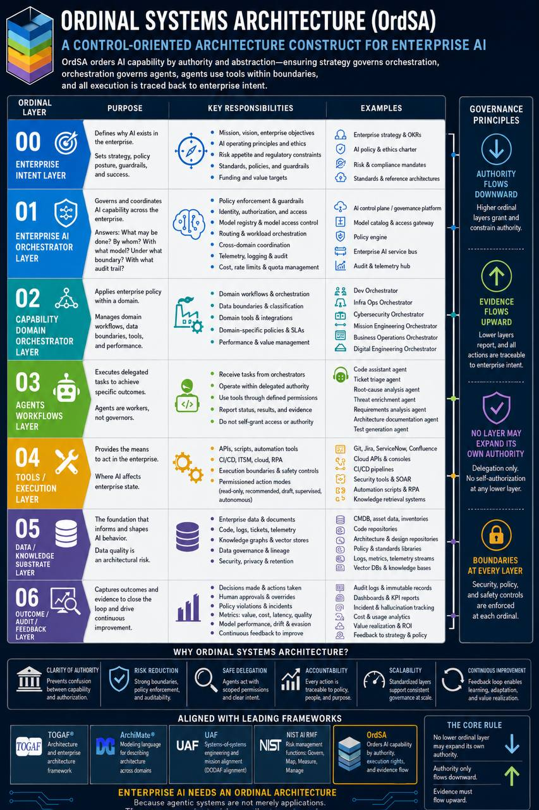

# Ordinal Systems Architecture (OrdSA)

**A control-oriented enterprise architecture construct for Enterprise AI that orders AI capability by ordered authority, abstraction, execution rights, and evidence flow.**

<p align="center">
  
</p>

> Enterprise AI needs an ordinal architecture because agentic systems are not merely applications. They are delegated actors inside a governed enterprise.

OrdSA's premise is simple: enterprise AI cannot be governed only by *components*. It must be governed by *order*. A model may appear capable. That does not mean it should be authorized.

OrdSA makes the distinction between **intelligence and authority** explicit.

---

## The Ordinal Layers

| # | Layer | What it governs |
|---|---|---|
| **O0** | [Enterprise Intent](docs/layers/O0-enterprise-intent.md) | Mission, strategy, policy, risk appetite, standards |
| **O1** | [Enterprise AI Orchestrator](docs/layers/O1-enterprise-ai-orchestrator.md) | Governance, routing, identity, model access, policy enforcement |
| **O2** | [Domain Orchestrators](docs/layers/O2-domain-orchestrators.md) | Development, infrastructure, cyber, mission, engineering, business |
| **O3** | [Agents and Workflows](docs/layers/O3-agents-workflows.md) | Task-specific AI workers under bounded delegation |
| **O4** | [Tools and Execution Channels](docs/layers/O4-tools-execution.md) | APIs, automation, ITSM, CI/CD, cloud, repositories |
| **O5** | [Data and Knowledge Substrate](docs/layers/O5-data-knowledge.md) | Documents, logs, CMDB, code, policies, telemetry, vector stores |
| **O6** | [Outcome, Audit, Feedback](docs/layers/O6-outcome-audit.md) | Evidence, metrics, decisions, incidents, drift, value realization |

## The Governance Principle

```
No lower ordinal layer may expand its own authority.
Authority only flows downward.
Evidence must flow upward.
```

That is the architectural core. Every other rule in OrdSA is a consequence of it.

---

## Why "Ordinal"?

*Ordinal* means **ordered**. The order is along four dimensions simultaneously:

1. **Authority** — what each layer is allowed to decide
2. **Abstraction** — how close to strategy vs. how close to execution
3. **Risk** — how much state each layer can change
4. **Execution rights** — read-only, recommend-only, draft-only, supervised, autonomous

A higher ordinal *contains* the authority of every lower ordinal. A lower ordinal cannot reach upward and grant itself rights it was not delegated.

This is the same logical structure that governs how real enterprises work — strategy authorizes operations, operations authorize execution, execution does not authorize itself. Most "AI architectures" today collapse these levels and confuse capability with authorization.

---

## Positioning vs. Existing Frameworks

OrdSA is **complementary**, not a replacement.

| Framework | What it gives you | What OrdSA adds |
|---|---|---|
| **TOGAF** | Architecture method | Authority grammar for AI capability layering |
| **UAF** | Systems-of-systems / mission alignment | Per-layer execution-rights model |
| **ArchiMate** | Modeling language | Vocabulary for AI-specific authority relations |
| **NIST AI RMF** | Risk management vocabulary (govern, map, measure, manage) | Concrete layered control surface to apply those functions against |

See [`docs/relationship-to-frameworks.md`](docs/relationship-to-frameworks.md) for the detailed mapping.

---

## Read the Construct

- **[`schema/`](schema/)** — **canonical OrdSA construct schema (source of truth per [ADR-ORDSA-0001](decisions/ADR-ORDSA-0001-schema-first-canonical-form.md))** — `ordsa-0.2.yaml` defines the construct; `example-deployment.yaml` shows the deployment-side shape; `schema/README.md` explains the two-schema model and validation flow
- **[`docs/concept.md`](docs/concept.md)** — canonical statement of the construct in prose (companion to the schema)
- **[`docs/layers/`](docs/layers/)** — one file per ordinal layer (O0 through O6)
- **[`docs/relationship-to-frameworks.md`](docs/relationship-to-frameworks.md)** — OrdSA next to TOGAF, UAF, ArchiMate, NIST AI RMF
- **[`docs/reference-implementations.md`](docs/reference-implementations.md)** — concrete implementations of OrdSA layers (forward placeholder; entries land as they mature)
- **[`decisions/README.md`](decisions/README.md)** — Architectural Decision Records (ADR index)

## Status

**v0.1.x — construct stable, v0.2 in motion.**

- v0.1 (2026-05-16): construct definition published as Markdown prose (seven layer files, framework positioning, governance principle).
- v0.1.1: repositioned as unaffiliated research; Ologos-specific framing removed.
- v0.1.2: PR-first ADR process formalized; `decisions/` directory and ADR index added.
- v0.1.3: founding ADRs 0001–0005 ratified the schema-first canonical form, YAML + JSON Schema representation, construct vs deployment schema shapes, Python + pydantic reference tooling, and ArchiMate-via-pyArchimate visual rendering pipeline.
- v0.1.4: construct schema sketch landed at [`schema/ordsa-0.2.yaml`](schema/ordsa-0.2.yaml) with an illustrative deployment example. Schema is hand-reviewable; mechanical validation follows when the reference tooling lands.
- v0.1.5: [ADR-ORDSA-0006](decisions/ADR-ORDSA-0006-rename-construct-to-ordsa.md) ratified — rename construct abbreviation from `OSA` to `OrdSA` (disambiguation from Open Systems Architecture / MOSA). Full name retained.
- v0.1.6 (this state): full migration to OrdSA naming — file names, ADR IDs, schema dialect strings, citation fields, all prose. Architecture poster published at [`docs/marketing/ordsa-architecture-poster.png`](docs/marketing/ordsa-architecture-poster.png).
- v0.2 (in progress): reference tooling (Python+pydantic validator, JSON Schema emitter), first ArchiMate-rendered diagrams via pyArchimate, schema-side refinements based on the v0.1.4 sketch.

Layer files remain intentionally brief; deep-dives, ArchiMate stereotype set, UAF mapping appendix, and worked examples follow in v0.2 and v0.3.

## Governance

OrdSA's construct-level decisions are captured as [Architectural Decision Records](decisions/README.md) — append-only records of what was decided, the alternatives considered, and the consequences accepted. The five **founding ADRs** establish the v0.2 baseline: schema-first canonical form ([0001](decisions/ADR-ORDSA-0001-schema-first-canonical-form.md)), YAML + JSON Schema ([0002](decisions/ADR-ORDSA-0002-schema-language-yaml-json-schema.md)), construct vs deployment schemas ([0003](decisions/ADR-ORDSA-0003-construct-vs-deployment-schemas.md)), Python + pydantic tooling ([0004](decisions/ADR-ORDSA-0004-reference-tooling-python-pydantic.md)), and ArchiMate via pyArchimate ([0005](decisions/ADR-ORDSA-0005-archi-as-canonical-modeling-tool.md)).

Future construct changes flow as ADR PRs per the process in [`CONTRIBUTING.md`](CONTRIBUTING.md). See [`decisions/README.md`](decisions/README.md) for the full index and conventions.

## Contributing

See [`CONTRIBUTING.md`](CONTRIBUTING.md). Substantive changes to the construct (new layers, layer redefinition, governance principle revision) go through **ADRs as PRs** (label `adr`); refinements and examples flow as ordinary PRs. Pre-PR brainstorming happens in [GitHub Discussions](https://github.com/osa-ai-org/ordsa-ai/discussions) under the Construct Q&A category.

## License

Documentation is licensed under [CC-BY-4.0](LICENSE). Future code contributions will be dual-licensed Apache-2.0; that addition will be called out explicitly when introduced.

## Authorship

- **JD Longmire**, AI Enterprise Architect
- **Micah Longmire**, AI Enterprise Architect

Both authors carry OrdSA through its full development cycle.

## Disclaimer

JD Longmire is a Northrop Grumman Fellow. OrdSA is unaffiliated research conducted in a personal capacity; views are the authors' own and do not represent Northrop Grumman Corporation or any other employer.
